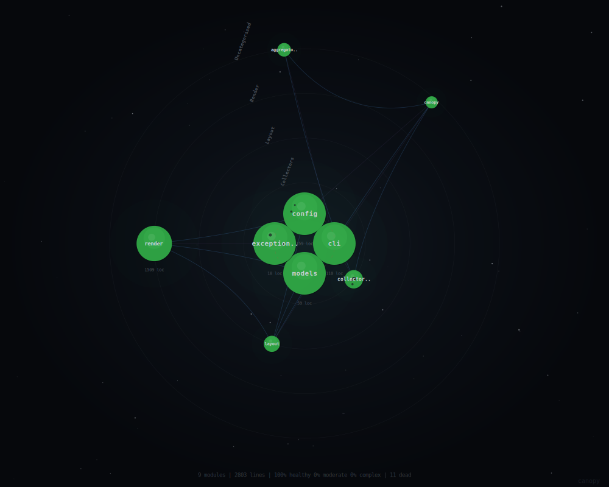

# Canopy

[](https://www.python.org)
[](LICENSE)

**Orbital SVG visualizations of codebase health.**

Canopy analyses your Python project — complexity, dead code, churn, and
module structure — then renders a single SVG diagram you can embed in your
README or CI artifacts. Click the diagram below for an interactive view
with tooltips, zoom and pan.

<p align="center">
  <a href="https://bruno-portfolio.github.io/canopy-code/canopy.html">
    
  </a>
</p>

## What it shows

| Visual element | Meaning |
|----------------|---------|
| Node **colour** | Health — green (healthy MI), amber (moderate), red (unhealthy) |
| Node **size** | Lines of code |
| **Pulse** ring | High git churn (recent changes) |
| **Spots** | Dead code detected by Vulture |
| **Rings** | Architectural layers defined in `canopy.yml` |
| **Edges** | Import dependencies between modules |

## Installation

```bash
pip install canopy-code
```

Canopy shells out to **radon** and **vulture**, so install them too:

```bash
pip install "canopy-code[tools]"
```

For development:

```bash
git clone https://github.com/your-org/canopy.git
cd canopy
pip install -e ".[dev,tools]"
pre-commit install
```

## Quick Start

```bash
# Analyse the current directory
canopy run .

# Specify a project path and output file
canopy run ./my-project --output docs/canopy.svg

# Generate SVG + interactive HTML viewer
canopy run . --output docs/canopy.svg --html docs/canopy.html

# Use a custom config
canopy run . --config path/to/canopy.yml
```

## Configuration

Create a `canopy.yml` (or `canopy.yaml`) at the project root. All fields
are optional — sensible defaults apply.

```yaml
project: myproject          # display name (default: directory name)
source: src/myproject       # source root relative to project (default: ".")
module_depth: 2             # how many levels to group (default: 2)

ignore:                     # glob patterns to exclude (future)
  - "tests/**"

layers:                     # architectural ring grouping
  core:
    modules: ["_core", "domain"]
  infra:
    modules: ["_cache", "_db"]
    label: Infrastructure

vulture:
  min_confidence: 60        # Vulture confidence threshold (default: 60)
  exclude_types:            # Vulture result types to ignore
    - attribute

git:
  churn_days: 30            # lookback window for churn (default: 30)

thresholds:
  mi_healthy: 40            # MI score above this is green (default: 40)
  mi_moderate: 20           # MI score above this is amber (default: 20)
  churn_high: 20            # commits above this triggers pulse (default: 20)
  min_loc: 50               # modules below this LOC get collapsed (default: 50)

output:
  path: docs/canopy.svg     # output file path (default: canopy.svg)
  width: 1000               # SVG width in pixels (default: 1000)
  height: 800               # SVG height in pixels (default: 800)
```

## GitHub Action

Add this workflow to `.github/workflows/canopy.yml` to regenerate the
diagram on every push to `main`:

```yaml
name: Canopy

on:
  push:
    branches: [main]

jobs:
  canopy:
    runs-on: ubuntu-latest
    permissions:
      contents: write
      pull-requests: write
    steps:
      - uses: actions/checkout@v4
        with:
          fetch-depth: 0    # full history for churn data
      - uses: bruno-portfolio/canopy-code@main
```

By default, the action creates a **pull request** with the updated diagram.
This works with branch protection rules and required status checks.

For repos without branch protection, you can push directly:

```yaml
      - uses: bruno-portfolio/canopy-code@main
        with:
          strategy: push
```

> **Note:** `fetch-depth: 0` is required for accurate churn data. Without
> it the clone is shallow and churn will be unavailable (Canopy warns and
> continues with churn = 0).

## Embedding in README

After the SVG is generated, reference it in your README:

```markdown

```

GitHub renders inline SVGs natively — no external hosting needed.

To link the static SVG to an interactive HTML viewer on GitHub Pages:

```html
<p align="center">
  <a href="https://your-user.github.io/your-repo/canopy.html">
    
  </a>
</p>
```

The HTML viewer is self-contained (zero external dependencies) and provides
hover tooltips, click-to-pin, zoom (scroll) and pan (drag).

## Limitations

- **Dynamic imports** (`importlib.import_module`, `__import__`) are not
  detected by the static AST parser.
- **`TYPE_CHECKING` imports** are treated as real imports (no special
  handling yet).
- **Shallow clones** produce no churn data — use `fetch-depth: 0` in CI.
- **`exclude_types`** in Vulture config is a v1 allowlist; per-module
  exclusions are not yet supported.
- **`ignore` patterns** are declared in config but not yet wired through
  collectors (planned for a future release).

## License

[MIT](LICENSE)
