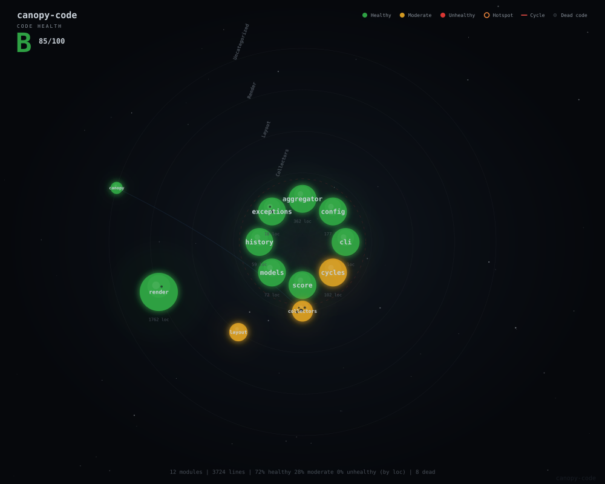

# Canopy Code

[](https://pypi.org/project/canopy-code/)
[](https://www.python.org)
[](LICENSE)
[](https://github.com/bruno-portfolio/canopy-code/actions/workflows/ci.yml)

**Orbital SVG visualizations of codebase health.**

Canopy analyses your Python project — per-function complexity, dead code,
git churn, test coverage and import structure — then renders a single SVG
diagram with an A–F health grade you can embed in your README or CI
artifacts. Click the diagram below for an interactive view with explainable
per-module scores, zoom and pan.

<p align="center">
  <a href="https://bruno-portfolio.github.io/canopy-code/canopy.html">
    
  </a>
</p>

## What it shows

| Visual element | Meaning |
|----------------|---------|
| **Grade badge** | Project health A–F (LOC-weighted module scores) with trend vs previous run |
| Node **colour** | Composite health score — green (≥75), amber (≥50), red (below) |
| Node **size** | Lines of code |
| **Orange pulse** ring | Hotspot — recent churn × low health, where defects cluster |
| **Spots** | Dead code detected by Vulture |
| **Red edges** | Import cycles between submodules (always visible) |
| **Rings** | Architectural layers defined in `canopy.yml` |
| Faint **blue edges** | Heaviest import dependencies (all edges on hover in HTML) |

### The score

Each module starts at 100 and loses points for named, auditable factors —
the HTML tooltip shows the exact breakdown:

| Factor | Penalty | Cap |
|--------|---------|-----|
| % of functions with cyclomatic complexity > 10 | `1.5 × pct` | −40 |
| Worst function in the module | `1.5 × (CC − 10)` | −20 |
| Dead symbols per function | `0.75 × pct` | −15 |
| Test coverage (only when a report exists) | `25 × (1 − coverage)` | −25 |

Maintainability Index is still collected and shown, but no longer drives
the colour — MI penalises file *size* far more than actual complexity.

Coverage is read from an existing `coverage.json` or `coverage.xml` in the
project root (canopy never runs your tests). The score weights are
configurable under `score:` in `canopy.yml`.

## Installation

```bash
pip install canopy-code
```

Canopy shells out to **radon** and **vulture**, so install them too:

```bash
pip install "canopy-code[tools]"
```

For development:

```bash
git clone https://github.com/bruno-portfolio/canopy-code.git
cd canopy-code
pip install -e ".[dev,tools]"
pre-commit install
```

## Quick Start

```bash
# Analyse the current directory
canopy run .

# Specify a project path and output file
canopy run ./my-project --output docs/canopy.svg

# Generate SVG + interactive HTML viewer
canopy run . --output docs/canopy.svg --html docs/canopy.html

# Use a custom config
canopy run . --config path/to/canopy.yml
```

## Configuration

Create a `canopy.yml` (or `canopy.yaml`) at the project root. All fields
are optional — sensible defaults apply.

```yaml
project: myproject          # display name (default: directory name)
source: src/myproject       # source root relative to project (default: ".")
module_depth: 2             # how many levels to group (default: 2)

ignore:                     # glob patterns excluded from analysis,
  - "vendored/**"           # relative to source (or project) root
  - "**/generated_*.py"

layers:                     # architectural ring grouping
  core:
    modules: ["_core", "domain"]
  infra:
    modules: ["_cache", "_db"]
    label: Infrastructure

vulture:
  min_confidence: 60        # Vulture confidence threshold (default: 60)
  exclude_types:            # Vulture result types to ignore
    - attribute

git:
  churn_days: 30            # lookback window for churn (default: 30)

score:
  cc_threshold: 10          # a function above this CC counts as complex (default: 10)
  complexity_spread: 1.5    # penalty per % of complex functions (default: 1.5)
  worst_function: 1.5       # penalty per CC point of the worst function (default: 1.5)
  dead_ratio: 0.75          # penalty per % of dead symbols (default: 0.75)
  coverage_weight: 25       # max penalty for 0% coverage (default: 25)

thresholds:
  score_healthy: 75         # score at or above this is green (default: 75)
  score_moderate: 50        # score at or above this is amber (default: 50)
  risk_hotspot: 0.4         # churn x unhealthiness above this pulses (default: 0.4)
  min_loc: 50               # modules below this LOC get collapsed (default: 50)

output:
  path: docs/canopy.svg     # output file path (default: canopy.svg)
  width: 1000               # SVG width in pixels (default: 1000)
  height: 800               # SVG height in pixels (default: 800)
```

Each run appends to `canopy-history.json` next to the SVG; the grade badge
shows the score delta against the previous run.

## GitHub Action

Add this workflow to `.github/workflows/canopy.yml` to regenerate the
diagram on every push to `main`:

```yaml
name: Canopy

on:
  push:
    branches: [main]

jobs:
  canopy:
    runs-on: ubuntu-latest
    permissions:
      contents: write
      pull-requests: write
    steps:
      - uses: actions/checkout@v4
        with:
          fetch-depth: 0    # full history for churn data
      - uses: bruno-portfolio/canopy-code@main
```

By default, the action creates a **pull request** with the updated diagram.
This works with branch protection rules and required status checks.

If your repo has **required status checks** on PRs, pass a PAT so the PR
triggers your test workflows (the default `GITHUB_TOKEN` won't):

```yaml
      - uses: actions/checkout@v4
        with:
          fetch-depth: 0
          token: ${{ secrets.CANOPY_PAT }}
      - uses: bruno-portfolio/canopy-code@main
        with:
          token: ${{ secrets.CANOPY_PAT }}
```

Create a [classic PAT](https://github.com/settings/tokens) with the **`public_repo`**
scope (fine-grained tokens don't trigger PR workflows), then add it as a repository
secret named `CANOPY_PAT`.

For repos without branch protection, you can push directly:

```yaml
      - uses: bruno-portfolio/canopy-code@main
        with:
          strategy: push
```

> **Note:** `fetch-depth: 0` is required for accurate churn data. Without
> it the clone is shallow and churn will be unavailable (Canopy warns and
> continues with churn = 0).

## Embedding in README

After the SVG is generated, reference it in your README:

```markdown

```

GitHub renders inline SVGs natively — no external hosting needed.

To link the static SVG to an interactive HTML viewer on GitHub Pages:

```html
<p align="center">
  <a href="https://your-user.github.io/your-repo/canopy.html">
    
  </a>
</p>
```

The HTML viewer is self-contained (zero external dependencies) and provides
hover tooltips, click-to-pin, zoom (scroll) and pan (drag).

## Limitations

- **Dynamic imports** (`importlib.import_module`, `__import__`) are not
  detected by the static AST parser.
- **`TYPE_CHECKING` imports** are ignored (they never execute at runtime);
  lazy imports inside functions still count as real dependencies.
- **Shallow clones** produce no churn data — use `fetch-depth: 0` in CI.
- **`exclude_types`** in Vulture config is a v1 allowlist; per-module
  exclusions are not yet supported.
- **Cycles through the root package** (`from pkg import x` + `__init__.py`
  re-exports) are intentionally not reported — only cycles between
  submodules are.

## License

[MIT](LICENSE)
